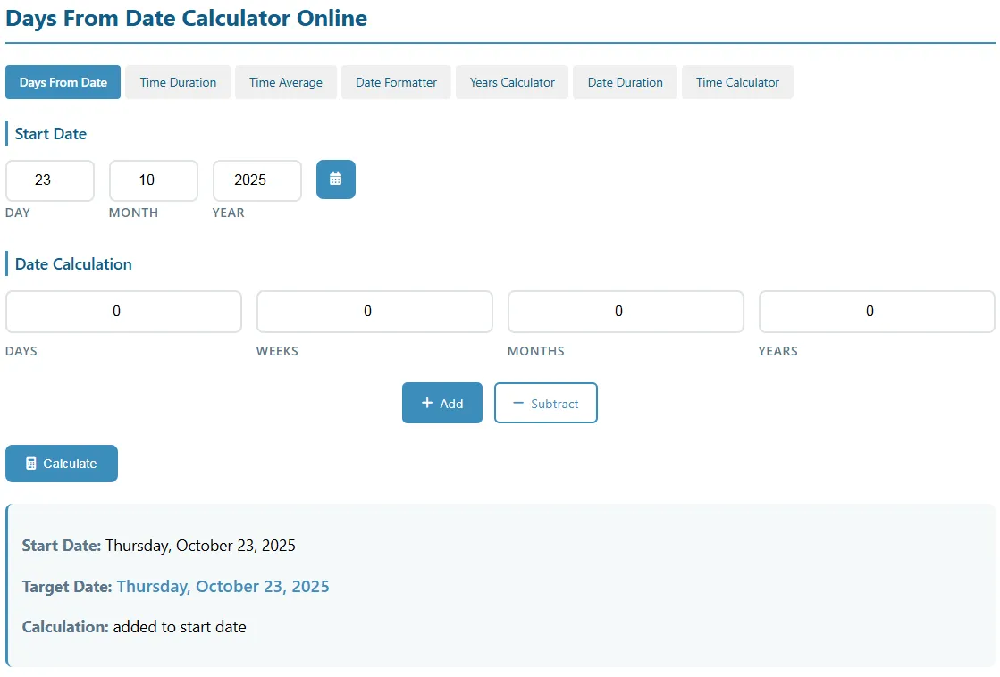
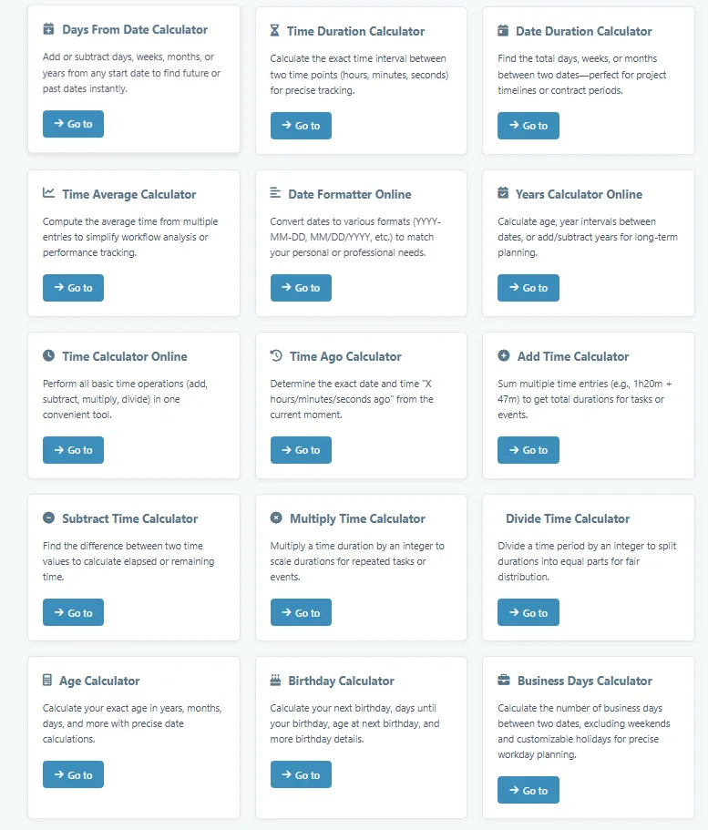

# 📅 Days From Date — Free Online Date Difference & Days Calculator

Welcome to **DaysFromDate.com** — a clean, fast, and easy-to-use web tool that helps you instantly calculate:

- How many days **from** a specific historical/future date to today
- How many days **between** any two dates
- What date it will be after adding/subtracting X days
- Weekdays/weekends/business days count (optional)

No sign-up, no installation, no ads overload — just open and use. Perfect for counting down to events, tracking milestones, planning projects, or just satisfying curiosity like "How many days have I lived?"

---

## ✨ Key Features

### ⏳ Core Days Calculators

- **Days From Date to Today**  
  Enter any past or future date → instantly see total days passed/remaining to now

- **Days Between Two Dates**  
  Calculate exact difference between any two dates (inclusive/exclusive options)

- **Add / Subtract Days**  
  Start from any date, add or subtract days/weeks/months → get resulting date

### 📊 Extra Useful Modes

- Business days / working days only (exclude weekends)
- Include or exclude end date in count
- Show result in multiple units: days, weeks + days, months + days approximation

### 🎨 Clean & Modern Interface

- Mobile-friendly & responsive design
- Dark / Light mode support (optional)
- Copy result to clipboard with one click
- Instant live calculation (no "Calculate" button needed in most cases)

---

## 🚀 Explore More Free Date and Time Utilities on the Site

Here are the most popular tools available on DaysFromDate.com — all free, no registration required:

- **[Time Duration Calculator](https://www.daysfromdate.com/time-duration-calculator)**: Calculates the interval between two time points (hours, minutes, seconds).
- **[Date Formatter](https://www.daysfromdate.com/date-formatter)**: Converts dates into different formats (e.g., YYYY-MM-DD, MM/DD/YYYY, DD MMMM YYYY).
- **[Years Calculator](https://www.daysfromdate.com/years-calculator)**: Quickly calculates age, year span, or duration in years/months/days.
- **[Time Average Calculator](https://www.daysfromdate.com/time-average-calculator)**: Computes average time from multiple time entries.
- **[Date Duration Calculator](https://www.daysfromdate.com/date-duration-calculator)**: Finds the exact duration between two dates in days, weeks, months.
- **[Time Calculator](https://www.daysfromdate.com/time-calculator)**: Performs addition and subtraction on times (e.g., add 2h 30m to 14:45).
- **[Time Ago Calculator](https://www.daysfromdate.com/time-ago-calculator)**: Determines how long ago a past date/time was (e.g., "3 days ago", "2 months ago").
- **[Age Calculator](https://www.daysfromdate.com/age-calculator)**: Calculates precise age in years, months, days from birthdate to today.
- **[Business Days Calculator](https://www.daysfromdate.com/business-days-calculator)**: Counts only weekdays (Mon-Fri), excluding weekends and optionally holidays.

These tools cover almost every common date/time calculation need — jump in and try them!

---

## 🚀 Try it Now!

🌐 **Live Demo & Main Site**: [https://www.daysfromdate.com/](https://www.daysfromdate.com/)

---

## 🛠️ Technologies Used

- HTML5 + CSS3 — clean, responsive layout
- Vanilla JavaScript — fast date calculations using native `Date` object
- No frameworks, no dependencies — super lightweight & instant loading
- SEO optimized for discoverability
- Pure static site — easy to host on GitHub Pages, Netlify, Vercel, Cloudflare Pages

---

## 👥 Who Is It For?

- **Everyone** who wants to quickly know "how many days since..." or "how many days until..."
- **Event planners** — weddings, trips, product launches, exams
- **Content creators** — YouTubers tracking "X days challenge"
- **Developers & students** — learning date manipulation or needing a reference tool
- **Anyone** curious about time passed since birth, historical events, etc.

---

## 📸 Screenshots

  

---

## 🤝 How to Contribute

Love the tool suite? Contributions welcome!

Possible ideas:
- Add holiday-aware business days (country-specific)
- Improve multi-unit breakdowns (more accurate months/years)
- Add dark mode toggle
- Enhance accessibility (ARIA, keyboard nav)
- Multi-language support
- Build open-source versions of the other tools

Standard fork → branch → PR flow.

---

## 📣 Stay Connected

- 🌐 Main Website: [https://www.daysfromdate.com/](https://www.daysfromdate.com/)
- 🐛 Issues / suggestions: Open here on GitHub
- 💡 New tool ideas? Drop them in issues!

---

## ⭐ Show Some Love

If these free tools help you, please **star** this repo!  
It helps spread the word about DaysFromDate.com.

Thanks for visiting! ⏳
